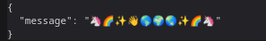
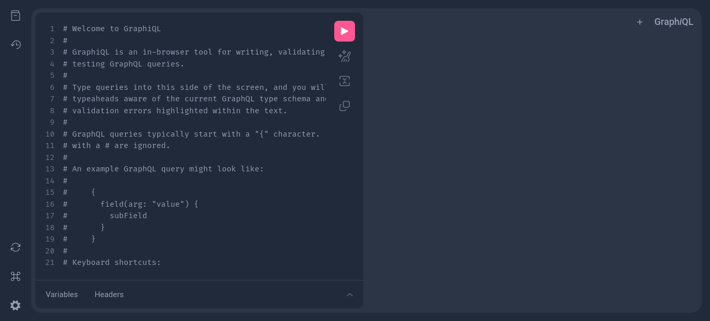

# MeetUN


---

## Table of contents

- [MeetUN](#meetun)
  - [Table of contents](#table-of-contents)
  - [Services available once deployed](#services-available-once-deployed)
    - [Frontend](#frontend)
    - [Authentication service](#authentication-service)
    - [GraphQL service](#graphql-service)
  - [Setup](#setup)
    - [Git submodules](#git-submodules)
      - [Updating submodules](#updating-submodules)
  - [Running the project](#running-the-project)
    - [Running with Docker Compose](#running-with-docker-compose)
      - [Build the project and run it](#build-the-project-and-run-it)
      - [Run the project without building](#run-the-project-without-building)

---

## Services available once deployed

### Frontend

This service will be accesible under the port
[`:80`](http://localhost/). And once it's ready the logs will show
something in the lines of (not exactly it):

```log
frontend-1  | > meetun_front@0.1.0 start
frontend-1  | > next start
frontend-1  | 
frontend-1  |    ▲ Next.js 15.3.2
frontend-1  |    - Local:        http://localhost:3000
frontend-1  |    - Network:      http://172.20.0.6:3000
frontend-1  | 
frontend-1  |  ✓ Starting...
frontend-1  |  ✓ Ready in 1169ms
```


### Authentication service

> [!WARNING]
> This API may not be accessible from your local machines in future
> releases since it will be behind a internal network

This service will be accesible under the port
[`:5000`](http://localhost:5000/). And once it's ready the logs will
show something in the lines of (not exactly it):

```log
auth-api-1  | All required environment variables are set.
            ·
            ·
            ·
auth-api-1  | All migrations have been successfully applied.
auth-api-1  | 
auth-api-1  | > auth_microservice@1.0.0 start
auth-api-1  | > node dist/index.js
auth-api-1  | 
auth-api-1  | Listening: http://localhost:5000
```



### GraphQL service

> [!WARNING]
> This API may not be accessible from your local machines in future
> releases since it will be behind a internal network

This service will be accesible under the port
[`:8008`](http://localhost:8008/). And once it's ready the logs will
show something in the lines of (not exactly it):

```log
main-api-1  | Waiting for the database to be ready...
main-api-1  | Running migrations...
            ·
            ·
            ·
main-api-1  | [[[MAIN API]]] Running the API now!
```



## Setup

Clone this repository adding the `--recurse-submodules` flag, e.g:

```sh
git clone --recurse-submodules git@github.com:SwArch-2025-1-2A/project.git
```

This should also pull the changes within each [submodule](#git-submodules).

If you forgot the `--recurse-submodules` or need to update the submodules themselves
you can just go [here](#updating-submodules)

### Git submodules

We are using [git submodules](https://git-scm.com/book/en/v2/Git-Tools-Submodules)
to manage each service.

> [!TIP]
> In order to have an easier time with git submodules, run the following
> commands. This will allow you to use these seamlessly (`--global` is completely
> optional).

```sh
git config --global push.recurseSubmodules on-demand
git config --global submodule.recurse true
```

> [!NOTE]
> Once you have excecuted these commands every time you `pull`/`fetch` changes
your modules will get updated. So if you move between branches you can just
`git pull` and you're good to go.

In case you want to manually update your submodules. Please refer to
[updating submodules](#updating-submodules).

#### Updating submodules

Once you have read about [git submodules](#git-submodules), you can understand
that these hold a SHA to a commit. So we have two ways of updating them if you
cannot configure the recommended configs.

1. Initialize, fetch and checkout any nested submodule with the _local status_
reference:

    ```sh
    git submodule update --init --recursive
    ```

1. Initialize, fetch and checkout any nested submodule with the status of their
remote-tracking branch:

    ```sh
    git submodule update --init --recursive --remote
    ```

## Running the project

### Running with Docker Compose

Make sure the submodules are [up-to-date](#updating-submodules) to avoid
possible issues with stale state.

#### Build the project and run it

```sh
docker compose up --build
```

#### Run the project without building

```sh
docker compose up
```
