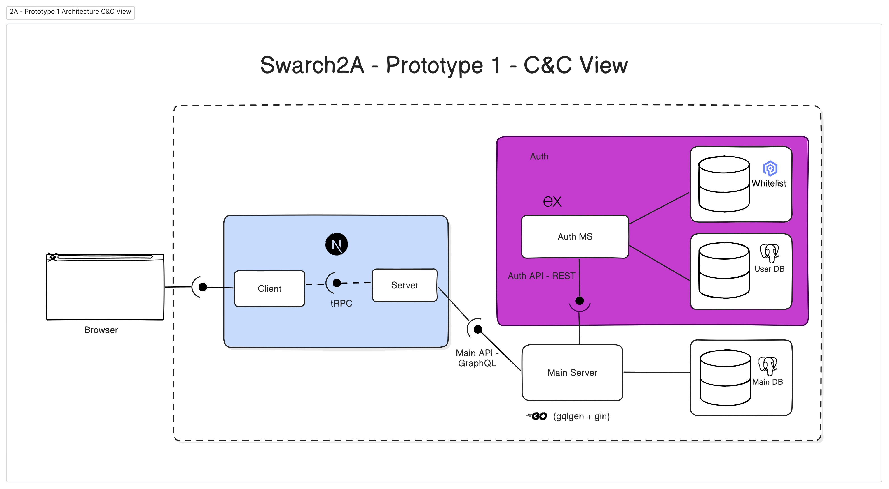

# Project: Prototype 1 - Simple Architectural Structure

## Team 2A

### Team Members

- Andrés Leonardo Leguizamón Gutiérrez
- Cesar Arthuro Lemos Silva
- Luis Gabriel Marín Muñoz
- Harrison Stiven Pinto Marulanda
- Andres Felipe Rojas Aguilar
- Diego Leandro Rodríguez Díaz

## Software System

> Meet people you can call your own. At Meet UN you can find people
> and communities to connect with, inside your campus.

Meet UN is a web platform designed exclusively for students of the
National University of Colombia. Its goal is to connect students
through official and unofficial groups based on shared interests such
as sports, study, research, culture, entrepreneurship, and more. The
platform allows users to create and manage groups, publish events,
and join active communities on campus. By fostering collaboration,
participation, and meaningful connections, MeetUN enhances student
life and strengthens the sense of community within the university.

## Component-and-Connector View

### Architectural styles used

- Layered Architecture
  - 3-Tier
    - Presentation
    - Logic
    - Data
- Client-Server Style
- Polyglot Architecture
- Service-Based Architecture
  - A modified version of `Microservices` Architecture: We don't fully
decompose/decouple all the modules into their own service/microservice.
- Distributed Architecture

### Architectural elements and relations

### Browser

- Type: External actor (User interface)
- Function: Initiates client interactions through a web application.
- Connector Communicates directly with the Client component

### Frontend (`mu_fe`)

#### Client (Next.js)

- Technology: Next.js
- Function: Renders the UI and allows user interaction
- Connector:
  - Receives input from `Browser`.
  - Calls `Server` using **tRPC** (Type-safe RPC).

#### Server (Next.js)

- Technology: Part of the same Next.js component as the Client (`mu_fe`)
- Function: Handles frontend business logic and communication with backend services.
- Connector:
  - Communicates with Main Server (`mu_main_be`) via **GraphQL**.

### Authenticacion

#### Auth MS (`mu_auth_ms`)

- Function: Manages authentication logic, user verification, and access control.
- Connector:
  - Exposes `Auth API` (**REST**) for the `Main Server`.
  - Accesses:
    - **Whitelist DB** Handles user tokens (not fully implmented yet)
    - **User DB** for login credentials and auth-related info.

### Core Backend

#### Main Server

- Technology: Go (with `gqlgen` + `gin`)
- Function: Hosts the **Main GraphQL API**, provides application core
logic and data operations.
- Connector:
  - Accepts GraphQL requests from the `Server`.
  - Communicates `Auth MS` via **REST API**.
  - Accesses `Main DB` to serve core data.

### Databases

#### Whitelist DB (`mu_whitelist_db`)

- Purpose: Stores allowlist or invitation tokens.
- Technology: Valkey

#### Auth DB (`mu_auth_db`)

- Purpose: Stores user credentials and profile data.
- Technology: PostgreSQL

#### Main DB (`mu_main_db`)

- Purpose: Stores core domain data of the application.
- Technology: PostgreSQL

## Prototype

Please refer to the instructions given [here](https://github.com/SwArch-2025-1-2A/project?tab=readme-ov-file#meetun)
