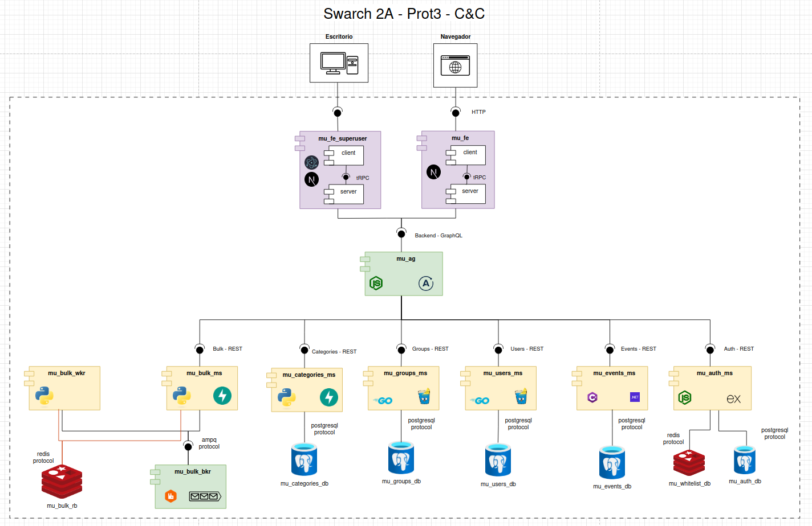

# Project: Prototype 3 - Quality Attributes (part 1)

## Team 2A

### Team Members

- Andrés Leonardo Leguizamón Gutiérrez
- Cesar Arthuro Lemos Silva
- Luis Gabriel Marín Muñoz
- Harrison Stiven Pinto Marulanda
- Andres Felipe Rojas Aguilar
- Diego Leandro Rodríguez Díaz

## Software System

> Meet people you can call your own. At Meet UN you can find people
> and communities to connect with, inside your campus.

Meet UN is a web platform designed exclusively for students of the
National University of Colombia. Its goal is to connect students
through official and unofficial groups based on shared interests such
as sports, study, research, culture, entrepreneurship, and more. The
platform allows users to create and manage groups, publish events,
and join active communities on campus. By fostering collaboration,
participation, and meaningful connections, MeetUN enhances student
life and strengthens the sense of community within the university.

## Architectural Structures

### Component-and-Connector Structure

#### Architectural styles used

- **Layered Architecture**: the components are organized into tiers (four more specifically), and some
components are made up of layers: the frontends are organized into client, api and server layers; and
the microservices written in Go have a repository layer. 
- **Client-Server Style**: all the components follow a client-server architecture: they listen to requests from other
components and respond to them.
- **Microservice-Based Architecture**: most (if not all) logic-type components are microservices. They are
independently deployable and implement only a part of the entire software system's functionality (a module).
- **Distributed Architecture**: the software system runs in multiple independently deployable services that can
run in different machines and communicate through a network.

#### Architectural patterns used

- **4-Tier architecture pattern**: the components can be classified into four tiers
  - Presentation (two frontends)
  - Orchestration/Communication (an API Gateway and the RabbitMQ broker)
  - Logic (multiple microservices)
  - Data (multiple SQL databases and key-value stores)
- **Broker pattern**: the bulk operation
 are put in a queue to handle them asynchronously.- **API Gateway pattern**: given that the logic is split into multiple components, it is necessary to orchestrate those
operations so that the frontend doesn't have to de
al with that complexity. This leads to a new component: an API Gateway
written in Typescript using Apollo Server.
- **Repository pattern**: the microservices written in Go have a repository layer, which encapsulates the queries to the SQL
database into Go functions.

#### Architectural elements and relations

##### Presentation tier

###### Browser

- Type: External actor (User interface)
- Responsibility: Initiates client interactions through a web application.
- Connector: Communicates directly with the Client component through HTTP

###### User Frontend (`mu_fe`)

Core web frontend, used by members of the university to find events, create groups, etc.
It has the following subarchitecture:

###### Client (Next.js)

- Technology: Next.js
- Responsibility: Renders the UI and allows user interaction
- Connector:
  - Receives input from `Browser` through HTTP.
  - Calls the `Server` subcomponent using **tRPC** (Type-safe RPC).

###### Server (Next.js)

- Technology: Part of the same Next.js component as the Client (`mu_fe`)
- Responsibility: Handles frontend business logic and communication with the API Gateway.
- Connector:
  - Communicates with the API Gateway (`mu_ag`) via **GraphQL**.

###### Superuser Frontend (`mu_fe_superuser`)

A desktop application used by admins (superusers) to interact with the `mu_bulk_ms` component
and carry out certain bulk operations asynchronously.
This presentation component is made with **Electron** and has the following subarchitecture:

###### Superuser Client (Next.js)

- Technology: Next.js
- Responsibility: Renders the UI and allows superuser interaction
- Connector:
  - Receives input from the desktop application through system calls
  - Calls the `Server` subcomponent using **tRPC** (Type-safe RPC).

###### Superuser Server (Next.js)

- Technology: Part of the same Next.js component as the Client (`mu_fe`)
- Responsibility: Handles frontend business logic and communication with the API Gateway.
- Connector:
  - Communicates with the API Gateway (`mu_ag`) via **GraphQL**.

##### Orchestration/Communication Tier

###### API Gateway (`mu_ag`)

- Technology: Apollo Server, which is a GraphQL server built on Node
- Responsibility: receives queries and mutations from the clients (`mu_fe` and `mu_fe_superuser`)
and carries them out through resolvers using the underlying REST APIs
- Connector:
  - Exposes a GraphQL API to the presentation-type components
  - Communicates with the logic-type components through REST

#### Microservices (logic-type components)

##### Auth MS (`mu_auth_ms`)

- Technology: TypeScript + Express framework
- Responsibility: Manages authentication logic (signup, login, logout) and token invalidation
- Connectors:
  - Exposes `Auth API` (**REST**) for the `API Gateway`.
  - Accesses the Whitelist DB through the Redis protocol and the Users DB through the Postgres protocol

##### Groups MS (`mu_groups_ms`)

- Technology: Go with the Gin framework for the REST API and sqlc to interact with the Postgres database
- Responsibility: manages group-related functionality, like creating groups, reading them to present them to the user, etc.
- Connectors:
  - Exposes `Groups API` (**REST**) for the `API Gateway`
  - Accesses the Groups DB through the Postgres protocol

##### Users MS (`mu_users_ms`)

- Technology: Go with the Gin framework for the REST API and sqlc to interact with the Postgres database
- Responsibility: manages normal user's data and related functionality that isn't related to authentication, like
profile pictures, usernames, etc.
- Connectors:
  - Exposes `Users API` (**REST**) for the `API Gateway`
  - Accesses the Users DB through the Postgres protocol

##### Events MS (`mu_events_ms`)

- Technology: C# with the .NET framework
- Responsibility: manage the data about events, like their start and end times, descriptions, pictures, places, etc.
- Connectors
  - Exposes `Events API` (**REST**) for the `API Gateway`
  - Accesses the Events DB through the Postgres protocol

##### Bulk MS (`mu_bulk_ms`)

- Technology: Python with the FastAPI framework
- Responsibility: enqueue bulk operations to carry them out asynchrously
- Connectors
  - Exposes `Bulk API` (**REST**) for the `API Gateway`
  - Interacts with a RabbitMQ broker throgh the AMPQ protocol
  - Stores results in a Redis key-value store, communicating with it through the Redis protocol

### Databases

#### Auth DB (`mu_auth_db`)

- Purpose: Stores user credentials and superuser status
- Technology: PostgreSQL

#### Whitelist DB (`mu_whitelist_db`)

- Purpose: Stores JWTs to allow secure logout and token invalidation
- Technology: Redis

#### Groups DB (`mu_groups_db`)

- Purpose: Postgres DB that stores group related data (names, descriptions, ids, profile pictures, etc)
- Technology: PostgreSQL

#### Users DB (`mu_users_db`)

- Purpose: Postgres DB that stores user-related data that has nothing to do with authentication
- Technology: PostgreSQL

#### Events DB (`mu_events_db`)

- Purpose: Postgres DB that stores event-related data
- Technology: PostgreSQL

#### Bulk Results Backend (`mu_bulk_rb`)

- Purpose: 
- Technolostore the results of the bulk operations.y: Redis

### Layered Structure

#### Architectural patterns

- **4-Tier:** The system uses a 4-Tier Architectural Pattern, which makes part of the N-tier pattern family,
- **API Gateway:** The system uses the API Gateway Architectural Pattern, which sits in the communication layer, and which allows the system to center the logic of the microservice use in only one component, logic like microservice authentication protection, creation of a unique API for the frontend, orchestrarion among different microservices functionality, etc.
- **Broker:** The system uses a broker pattern, which consists of having a component that mediates between a service and various clients trying to cconenct to it. It is implemented by the Web-Queue-Worker.
- **Repository:** 

#### Description of modules, submodules

- **MeetUN System:** It is the whole system.
  - **Frontends:** The frontends module encapsulates all the presentation logic
    - **Superuser Frontend:** It is a dedicated frontend, intended for the superuser to handle some heavy tasks.
    - **Main Frontend:** It is the main entrypoint for almost all users of our system, allowing them to have a profile, create groups, etc.
  - **Backend:** The backend is the module of the system that implements most of the business logic of MeetUN's
    - **API Gateway:** The API Gateway module handles the orchestration of all the submodules of the microservices module. It also protects them from unauthorized access, and mediates their interaction between the frontends module, and them.
    - **Microservices:** This module encompasses all the microservices, each oone having their own very dedicated responsibility.
      - **Auth:** The auth module allows the creation of a new user, along with providing login and logout capabilites, by using JWT tokens to grant access to the system main functionalities.
      - **Users:** The module handles the logic of the users profiles, like their update.
      - **Groups:** The module allows for groups creation and retrieval
      - **Events** The events module allows to create new events, see them, delete them, etc.
      - **Asynchronous Management** This module can handle asynchronous tasks. By now, it can handle a very basic task creation, but it is intended to be capable of handling heavy tasks that the superuser can do.

### Decomposition Structure

 AI

### Deployment Structure

 AI

## Prototype

Please refer to the instructions given [here](https://github.com/SwArch-2025-1-2A/project?tab=readme-ov-file#meetun)
