# Project: Prototype 3 - Quality Attributes

## Table of contents

- [Project: Prototype 3 - Quality Attributes](#project-prototype-3---quality-attributes)
  - [Table of contents](#table-of-contents)
  - [Team 2A](#team-2a)
    - [Team Members](#team-members)
  - [Software System](#software-system)
  - [Architectural Structures](#architectural-structures)
    - [Component-and-Connector Structure](#component-and-connector-structure)
      - [C\&C View](#cc-view)
      - [Architectural styles used](#architectural-styles-used)
      - [Architectural patterns used](#architectural-patterns-used)
      - [Architectural elements and relations](#architectural-elements-and-relations)
      - [Architectural elements and relations](#architectural-elements-and-relations-1)
        - [Outside the system](#outside-the-system)
          - [Browser](#browser)
        - [Infrastructure tier 1](#infrastructure-tier-1)
          - [Web reverse proxy (`mu_web_rp`)](#web-reverse-proxy-mu_web_rp)
        - [Presentation tier](#presentation-tier)
          - [User Frontend (`mu_fe`)](#user-frontend-mu_fe)
          - [Client (Next.js)](#client-nextjs)
          - [Server (Next.js)](#server-nextjs)
          - [Superuser Frontend (`mu_fe_superuser`)](#superuser-frontend-mu_fe_superuser)
          - [Superuser Client (Next.js)](#superuser-client-nextjs)
          - [Superuser Server (Next.js)](#superuser-server-nextjs)
        - [Infrastructure Tier 2](#infrastructure-tier-2)
        - [Orchestration/Communication Tier](#orchestrationcommunication-tier)
          - [API Gateway (`mu_ag`)](#api-gateway-mu_ag)
      - [Microservices (logic-type components)](#microservices-logic-type-components)
        - [Auth MS (`mu_auth_ms`)](#auth-ms-mu_auth_ms)
        - [Groups MS (`mu_groups_ms`)](#groups-ms-mu_groups_ms)
        - [Users MS (`mu_users_ms`)](#users-ms-mu_users_ms)
        - [Events MS (`mu_events_ms`)](#events-ms-mu_events_ms)
        - [Bulk MS (`mu_bulk_ms`)](#bulk-ms-mu_bulk_ms)
      - [Databases](#databases)
        - [Auth DB (`mu_auth_db`)](#auth-db-mu_auth_db)
        - [Whitelist DB (`mu_whitelist_db`)](#whitelist-db-mu_whitelist_db)
        - [Groups DB (`mu_groups_db`)](#groups-db-mu_groups_db)
        - [Users DB (`mu_users_db`)](#users-db-mu_users_db)
        - [Events DB (`mu_events_db`)](#events-db-mu_events_db)
        - [Bulk Results Backend (`mu_bulk_rb`)](#bulk-results-backend-mu_bulk_rb)
    - [Layered Structure](#layered-structure)
      - [Layered View](#layered-view)
      - [Architectural patterns](#architectural-patterns)
      - [Description of layers](#description-of-layers)
    - [Deployment Structure](#deployment-structure)
      - [Deployment View](#deployment-view)
    - [Índice de Redes y sus Acrónimos](#índice-de-redes-y-sus-acrónimos)
    - [Decomposition Structure](#decomposition-structure)
      - [Decomposition View](#decomposition-view)
      - [Description of architectural elements and relations](#description-of-architectural-elements-and-relations)
  - [Quality Attributes](#quality-attributes)
    - [Security](#security)
      - [Security Scenarios](#security-scenarios)
        - [Channel Pattern](#channel-pattern)
        - [Proxy Pattern](#proxy-pattern)
        - [Segmentation Pattern](#segmentation-pattern)
        - [Replicated system](#replicated-system)
    - [Performance](#performance)
      - [Performance Scenarios](#performance-scenarios)
        - [Load balancer](#load-balancer)
        - [Broker](#broker)
      - [Performance testing analysis and results](#performance-testing-analysis-and-results)
  - [Prototype](#prototype)

## Team 2A

### Team Members

- Andrés Leonardo Leguizamón Gutiérrez
- Cesar Arthuro Lemos Silva
- Luis Gabriel Marín Muñoz
- Harrison Stiven Pinto Marulanda
- Andres Felipe Rojas Aguilar
- Diego Leandro Rodríguez Díaz

## Software System

> Meet people you can call your own. At Meet UN you can find people
> and communities to connect with, inside your campus.

Meet UN is a web platform designed exclusively for students of the
National University of Colombia. Its goal is to connect students
through official and unofficial groups based on shared interests such
as sports, study, research, culture, entrepreneurship, and more. The
platform allows users to create and manage groups, publish events,
and join active communities on campus. By fostering collaboration,
participation, and meaningful connections, MeetUN enhances student
life and strengthens the sense of community within the university.

## Architectural Structures

### Component-and-Connector Structure

#### C&C View

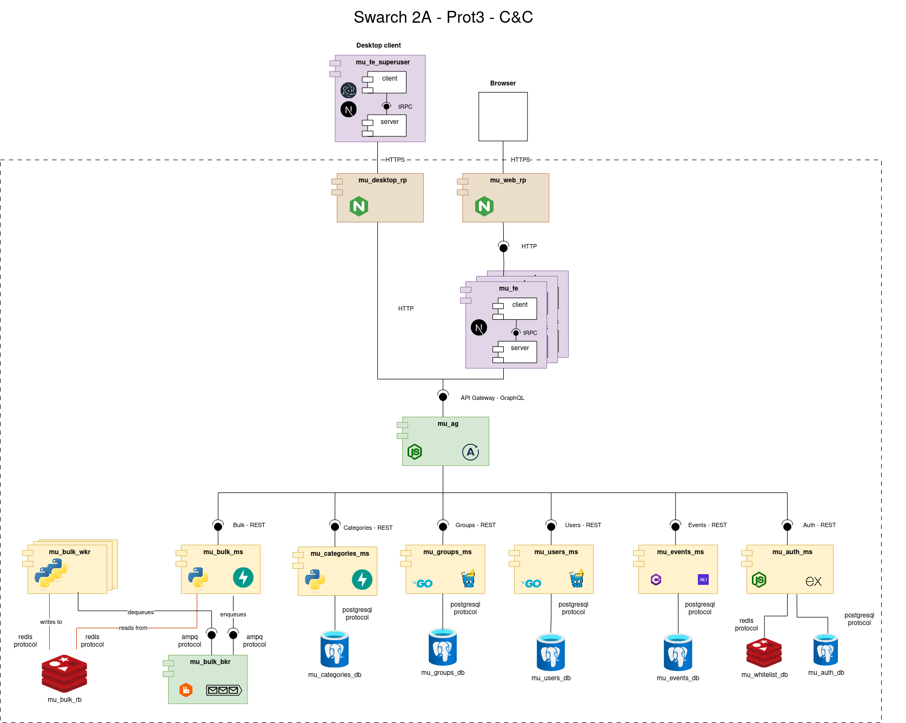

#### Architectural styles used

- **Layered Architecture**: the components are organized into tiers (seven more specifically), and some
  components are made up of layers: the frontends are organized into client, api and server layers; and
  the microservices written in Go and .NET have a repository layer.
- **Client-Server Style**: all the components follow a client-server architecture: they listen to requests from other
  components and respond to them.
- **Microservice-Based Architecture**: most (if not all) logic-type components are microservices. They are
  independently deployable and implement only a part of the entire software system's functionality (a module).
- **Distributed Architecture**: the software system runs in multiple independently deployable services that can
  run in different machines and communicate through a network.

#### Architectural patterns used

- **7-Tier architecture pattern**: the components can be classified into seven tiers
  - Infrastructure: the first infrastructure layer has a reverse proxy that also acts as a load balancer. The client's web browser accesses it
    and its requests are forwarded to one out of three frontend replicas
  - Presentation: two frontends, one a web frontend and the other a desktop frontend
  - Infrastructure: a second infrastructure layer, which has a reverse proxy that the desktop client accesses to interact with the API Gateway
  - Orchestration: an API Gateway takes GraphQL requests from the frontends and responds to them by orchestrating the microservices in the backend
    that expose REST APIs
  - Logic: six different microservices, taking care of different system functionalities
  - Communication: a message broker (RabbitMQ) receives tasks from the bulk microservice and puts them in a queue, which the bulk workers then read
    to know which tasks to process. This makes it possible to have asynchronous communication
  - Data: multiple SQL databases and key-value stores
- **Broker pattern**: the bulk operations are put in a queue to handle them asynchronously.
- **API Gateway pattern**: given that the logic is split into multiple components, it is necessary to orchestrate those
  operations so that the frontend doesn't have to deal with that complexity. This leads to a new component: an API Gateway
  written in Typescript using Apollo Server.
- **Reverse proxy pattern**: the only components that are accesible from the public internet are the two reverse proxies. This way, internal components
  of the system like the API Gateway and the web frontend are protected from unauthorized access.
- **Load balancer pattern**: an Nginx reverse proxy also works as a load balancer, forwarding requests equally between the three web frontend instances
  of the system
- **Secure channel**: the communication between the reverse proxies and the browser and desktop client are made through HTTPS, which encrypts the
  communication and protects it from interception.
- **Replication**: the web frontends are replicated (there are three instances), which increases the availability of the system (a key security
  attribute) and also makes it possible to handle increased loads
- **Repository pattern**: the microservices written in Go and .NET have a repository layer, which encapsulates the queries to the SQL
  database into Go and C# functions.

#### Architectural elements and relations
#### Architectural elements and relations

##### Outside the system 

###### Browser

- Type: External actor (User interface)
- Responsibility: Initiates client interactions through a web application.
- Connector: Communicates directly with the Client component through HTTP

##### Infrastructure tier 1

###### Web reverse proxy (`mu_web_rp`)

- Technology: Nginx 
- Responsibility: forward requests from the client's browser to the web frontend, so that the frontend doesn't have to be exposed to the public
  internet, and also acts as a load balancer among the three frontend instances
- Connector: 
  - Receives input from `Browser` through HTTPS
  - Connects to the web frontend `mu_fe` through HTTP

##### Presentation tier

###### User Frontend (`mu_fe`)

Core web frontend, used by members of the university to find events, create groups, etc.
It has the following subarchitecture:

###### Client (Next.js)

- Technology: Next.js
- Responsibility: Renders the UI and allows user interaction
- Connector:
  - Receives input from `mu_web_rp` through HTTP.
  - Calls the `Server` subcomponent using **tRPC** (Type-safe RPC).

###### Server (Next.js)

- Technology: Part of the same Next.js component as the Client (`mu_fe`)
- Responsibility: Handles frontend business logic and communication with the API Gateway.
- Connector:
  - Communicates with the API Gateway (`mu_ag`) via **GraphQL**.

###### Superuser Frontend (`mu_fe_superuser`)

A desktop application used by admins (superusers) to interact with the `mu_bulk_ms` component
and carry out certain bulk operations asynchronously.
This presentation component is made with **Electron** and has the following subarchitecture:

###### Superuser Client (Next.js)

- Technology: Next.js
- Responsibility: Renders the UI and allows superuser interaction
- Connector:
  - Receives input from the desktop application through system calls
  - Calls the `Server` subcomponent using **tRPC** (Type-safe RPC).

###### Superuser Server (Next.js)

- Technology: Part of the same Next.js component as the Client (`mu_fe_superuser`)
- Responsibility: Handles frontend business logic and communication with the API Gateway.
- Connector:
  - Communicates with the desktop reverse proxy `mu_desktop_rp ` through HTTPS.

##### Infrastructure Tier 2

- Technology: Nginx
- Responsibility: forward requests from the desktop frontend to the API Gateway, so that the API Gateway doesn't have to be exposed to the public
  internet
- Connector:
  - Receives input from `mu_fe_superuser` through HTTPS
  - Connects to the API Gateway `mu_ag` through HTTP

##### Orchestration/Communication Tier

###### API Gateway (`mu_ag`)

- Technology: Apollo Server, which is a GraphQL server built on Node
- Responsibility: receives queries and mutations from the clients (`mu_fe` and `mu_fe_superuser` indirectly through a reverse proxy)
  and carries them out through resolvers using the underlying REST APIs of the microservices
- Connector:
  - Exposes a GraphQL API to the web frontend and the superuser frontend for the desktop (indirectly)
  - Communicates with the logic-type components through REST

#### Microservices (logic-type components)

##### Auth MS (`mu_auth_ms`)

- Technology: TypeScript + Express framework
- Responsibility: Manages authentication logic (signup, login, logout) and token invalidation
- Connectors:
  - Exposes `Auth API` (**REST**) for the `API Gateway`.
  - Accesses the Whitelist DB through the Redis protocol and the Users DB through the Postgres protocol

##### Groups MS (`mu_groups_ms`)

- Technology: Go with the Gin framework for the REST API and sqlc to interact with the Postgres database
- Responsibility: manages group-related functionality, like creating groups, reading them to present them to the user, etc.
- Connectors:
  - Exposes `Groups API` (**REST**) for the `API Gateway`
  - Accesses the Groups DB through the Postgres protocol

##### Users MS (`mu_users_ms`)

- Technology: Go with the Gin framework for the REST API and sqlc to interact with the Postgres database
- Responsibility: manages normal user's data and related functionality that isn't related to authentication, like
  profile pictures, usernames, etc.
- Connectors:
  - Exposes `Users API` (**REST**) for the `API Gateway`
  - Accesses the Users DB through the Postgres protocol

##### Events MS (`mu_events_ms`)

- Technology: C# with the .NET framework
- Responsibility: manage the data about events, like their start and end times, descriptions, pictures, places, etc.
- Connectors
  - Exposes `Events API` (**REST**) for the `API Gateway`
  - Accesses the Events DB through the Postgres protocol

##### Bulk MS (`mu_bulk_ms`)

- Technology: Python with the FastAPI framework
- Responsibility: enqueue bulk operations to carry them out asynchrously
- Connectors
  - Exposes `Bulk API` (**REST**) for the `API Gateway`
  - Interacts with a RabbitMQ broker throgh the AMPQ protocol
  - Stores results in a Redis key-value store, communicating with it through the Redis protocol

#### Databases

##### Auth DB (`mu_auth_db`)

- Purpose: Stores user credentials and superuser status
- Technology: PostgreSQL

##### Whitelist DB (`mu_whitelist_db`)

- Purpose: Stores JWTs to allow secure logout and token invalidation
- Technology: Redis

##### Groups DB (`mu_groups_db`)

- Purpose: Postgres DB that stores group related data (names, descriptions, ids, profile pictures, etc)
- Technology: PostgreSQL

##### Users DB (`mu_users_db`)

- Purpose: Postgres DB that stores user-related data that has nothing to do with authentication
- Technology: PostgreSQL

##### Events DB (`mu_events_db`)

- Purpose: Postgres DB that stores event-related data
- Technology: PostgreSQL

##### Bulk Results Backend (`mu_bulk_rb`)

- Purpose:
- Technolostore the results of the bulk operations.y: Redis

### Layered Structure

#### Layered View

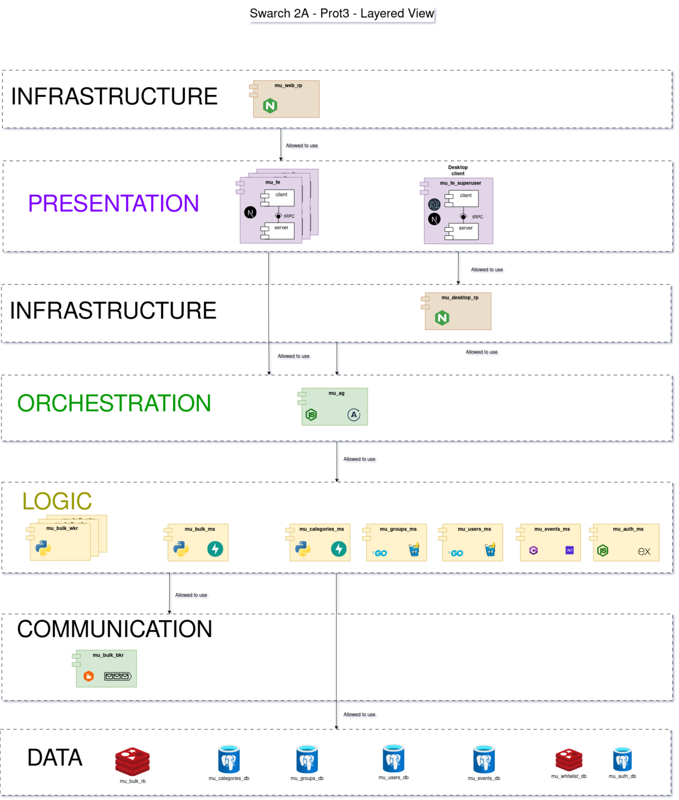

#### Architectural patterns

- **7-Tier:** The system uses a 7-Tier Architectural Pattern, which makes part of the N-tier pattern family,
- **API Gateway:** The system uses the API Gateway Architectural Pattern, which sits in the communication layer, and which allows the system to center the logic of the microservice use in only one component, logic like microservice authentication protection, creation of a unique API for the frontend, orchestrarion among different microservices functionality, etc.
- **Broker:** The system uses a broker pattern, which consists of having a component that mediates between a service and various clients trying to cconenct to it. It is implemented by the Web-Queue-Worker.
- **Reverse Proxy Pattern:** The reverse proxy takes the requests that go into the software system, allowing it to filter them, redirect them to certain instances of the services (load balancing), etc.

#### Description of layers

- **Presentation:** The presentation layers comprises the frontends of the software system, which make its functionalities available to the end users.
- **Infrastructure:** This layer is not directly tied to a functionality, and is rather focused on various patterns and tactics, mainly focused on security. In this software system, the infrastructure layer comprises two nginx reverse proxies.
- **Orchestration:** The orchestration layer has the API Gateway component of the system. The function of this layer is to handle the cooperation between the components of inferior layers, taking into account theey do not interact among them. It also unifies them into a single interface for the presentation layer to communicate with them.
- **Logic:** The logic layer comprises various components, which handle most of the business logic of the system, and also communicate directly with the data layer
- **Data:** The data layer is responsible for the long term storage of the system. It's components are mainly databases, and it can be accessed through the logic layer.

### Deployment Structure

#### Deployment View

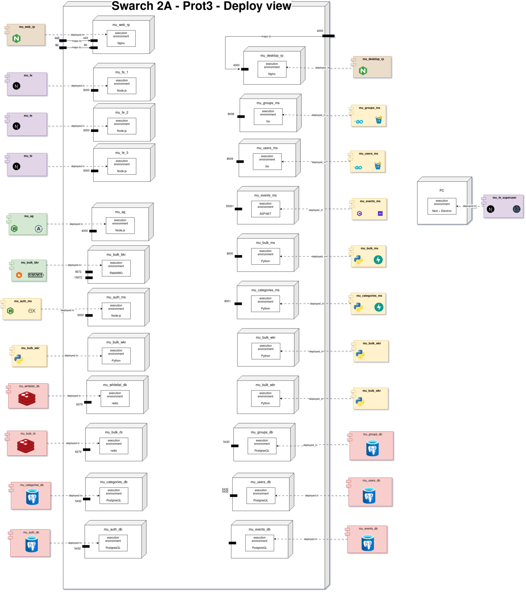

| Servicio          | fw_net | ad_net | am_net | bm_net | cd_net | cm_net | dr_net | ed_net | em_net | gd_net | gm_net | ud_net | um_net | wd_net | pb_net |
|-------------------|--------|--------|--------|--------|--------|--------|--------|--------|--------|--------|--------|--------|--------|--------|--------|
| mu_fe_prod1       |   X    |        |        |        |        |        |        |        |        |        |        |        |        |        |        |
| mu_fe_prod2       |   X    |        |        |        |        |        |        |        |        |        |        |        |        |        |        |
| mu_fe_prod3       |   X    |        |        |        |        |        |        |        |        |        |        |        |        |        |        |
| mu_ag_prod        |   X    |   X    |   X    |   X    |        |   X    |   X    |        |   X    |   X    |   X    |        |   X    |        |        |
| mu_users_ms_prod  |        |        |        |        |        |        |        |        |        |        |        |        |   X    |        |        |
| mu_users_db_prod  |        |        |        |        |        |        |        |        |        |        |        |   X    |        |        |        |
| mu_groups_ms_prod |        |        |        |        |        |        |        |        |        |        |   X    |        |        |        |        |
| mu_groups_db_prod |        |        |        |        |        |        |        |        |        |   X    |        |        |        |        |        |
| mu_categories_ms_prod |     |        |        |        |        |   X    |        |        |        |        |        |        |        |        |        |
| mu_categories_db_prod |     |        |        |        |   X    |        |        |        |        |        |        |        |        |        |        |
| mu_events_ms_prod |        |        |        |        |        |        |        |        |   X    |        |        |        |        |        |        |
| mu_events_db_prod |        |        |        |        |        |        |        |   X    |        |        |        |        |        |        |        |
| mu_auth_ms_prod   |        |        |   X    |        |        |        |        |        |        |        |        |        |        |        |        |
| mu_auth_db_prod   |        |   X    |        |        |        |        |        |        |        |        |        |        |        |        |        |
| mu_whitelist_db_prod |     |        |        |        |        |        |        |        |        |        |        |        |        |   X    |        |
| mu_bulk_rb_prod   |        |        |        |   X    |        |        |        |        |        |        |        |        |        |        |        |
| mu_bulk_bkr_prod  |        |        |        |   X    |        |        |        |        |        |        |        |        |        |        |        |
| mu_bulk_ms_prod   |        |        |        |   X    |        |        |        |        |        |        |        |        |        |        |        |
| mu_bulk_wkr_prod  |        |        |        |   X    |        |        |        |        |        |        |        |        |        |        |        |
| mu_web_rp         |   X    |        |        |        |        |        |        |        |        |        |        |        |        |        |   X    |
| mu_desktop_rp     |        |        |        |        |        |        |   X    |        |        |        |        |        |        |        |   X    |

### Índice de Redes y sus Acrónimos

| Acrónimo | Nombre completo de la red       |
|----------|----------------------------------|
| fw_net   | front_web_net                   |
| ad_net   | mu_auth_db_net                  |
| am_net   | mu_auth_ms_net                  |
| bm_net   | mu_bulk_ms_net                  |
| cd_net   | mu_categories_db_net           |
| cm_net   | mu_categories_ms_net           |
| dr_net   | mu_desktop_rp_net              |
| ed_net   | mu_events_db_net               |
| em_net   | mu_events_ms_net               |
| gd_net   | mu_groups_db_net               |
| gm_net   | mu_groups_ms_net               |
| ud_net   | mu_users_db_net                |
| um_net   | mu_users_ms_net                |
| wd_net   | mu_whitelist_db_net            |
| pb_net   | public                          |

### Decomposition Structure

#### Decomposition View

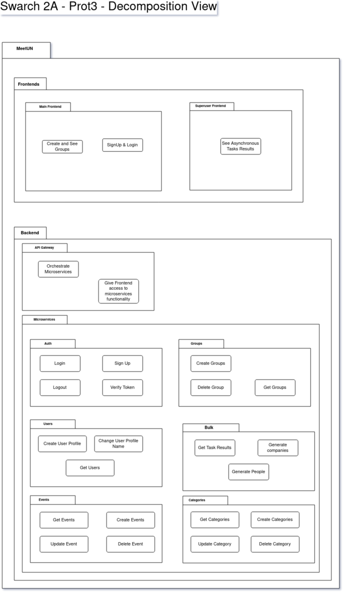

#### Description of architectural elements and relations

- **MeetUN System:** It is the whole system.
  - **Frontends:** The frontends module encapsulates all the presentation logic
    - **Superuser Frontend:** It is a dedicated frontend, intended for the superuser to handle some heavy tasks.
    - **Main Frontend:** It is the main entrypoint for almost all users of our system, allowing them to have a profile, create groups, etc.
  - **Backend:** The backend is the module of the system that implements most of the business logic of MeetUN's
    - **API Gateway:** The API Gateway module handles the orchestration of all the submodules of the microservices module. It also protects them from unauthorized access, and mediates their interaction between the frontends module, and them.
    - **Microservices:** This module encompasses all the microservices, each oone having their own very dedicated responsibility.
      - **Auth:** The auth module allows the creation of a new user, along with providing login and logout capabilites, by using JWT tokens to grant access to the system main functionalities.
      - **Users:** The module handles the logic of the users profiles, like their update.
      - **Groups:** The module allows for groups creation and retrieval
      - **Events** The events module allows to create new events, see them, delete them, etc.
      - **Asynchronous Management** This module can handle asynchronous tasks. By now, it can handle a very basic task creation, but it is intended to be capable of handling heavy tasks that the superuser can do.

## Quality Attributes

### Security

#### Security Scenarios

##### Channel Pattern

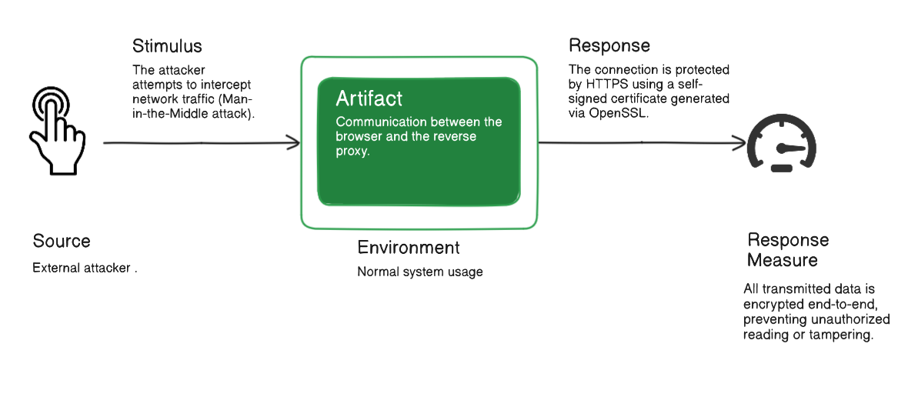

**Applied Architectural Tactics**:

- **Encrypt Data**: Ensures confidentiality by encrypting messages sent between client and server.
- **Verify Message Integrity**: Verifies that messages have not been tampered with during transmission.

**Applied Architectural Patterns**:

- **Secure Channel Pattern**: Implemented using HTTPS with self-signed certificates (OpenSSL) to protect communication between browser and NGINX reverse proxy.

##### Proxy Pattern

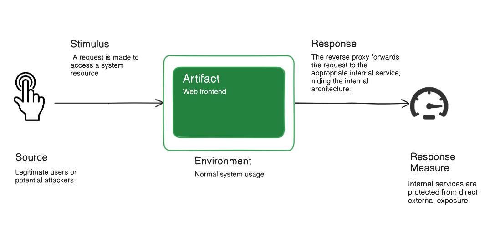

**Applied Architectural Tactics**:

- **Limit Exposure**: Reduces the surface area exposed to external access by hiding internal services behind a proxy.
- **Separate Entities**: Keeps frontend and backend services decoupled for better control and security.

**Applied Architectural Patterns**:

- **Reverse Proxy Pattern**: NGINX acts as an intermediary between users and backend services, controlling and redirecting requests appropriately.

##### Segmentation Pattern

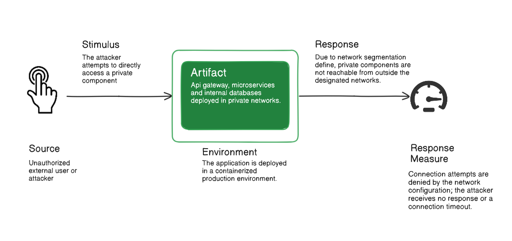

**Applied Architectural Tactics**:

- **Separate Entities**: Isolates services into different network segments to limit unauthorized access between components.
- **Limit Access**: Applies network-level restrictions between microservices and databases.

**Applied Architectural Patterns**:

- **Network Segmentation Pattern**: Implemented through Docker Compose-defined networks, restricting communication to only required components.

##### Replicated system

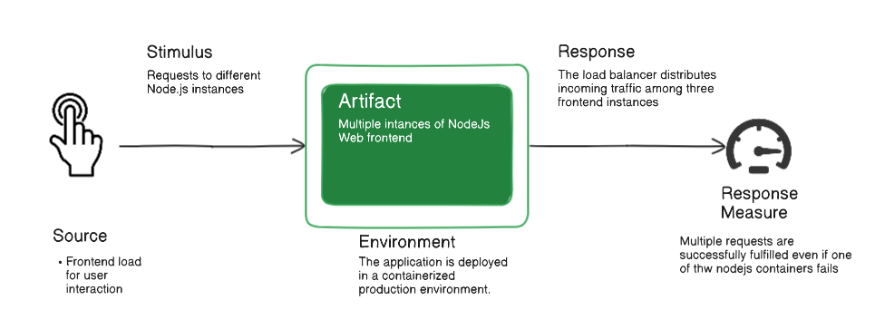

**Applied Architectural Tactics**:

- **Separate Entities**:- Consists of dividing the system into separate components or processes that run in different environments

**Applied Architectural Patterns**:

- **Replicated system**: Redundant components, and a means of load balancing and redirection in between to decrease the chance of non-availability of the service.

### Performance

#### Performance Scenarios

##### Load balancer

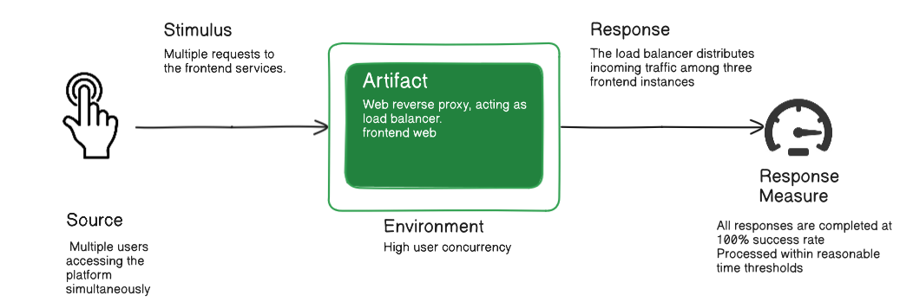

**Applied Architectural Tactics**:

- **Introduce Concurrency**: Configure multiple Node.js instances or use worker threads, replicate the authentication database, and leverage the default load balancer provided by Docker Compose.

**Applied Architectural Patterns**:

- **Load balancer**: As previously mentioned, a load balancer will properly distribute workloads across multiple Node.js instances.  Implemented using NginX, it distributes the load to different instances of the graphical interface using the _Round Robin_ method.

##### Broker

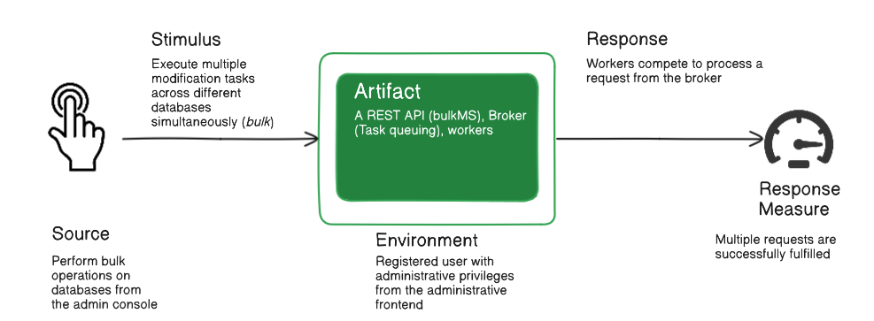

**Applied Architectural Tactics**:

- **Manage Work Requests**: - Alongside the introduction of concurrency, it allows managing incoming requests while the workers handle fetching and processing them

**Applied Architectural Patterns**:

- **Broker**: - Intermediary manages communication between components

- **Competing Consumers**: Implemented in the asynchronous work module _Bulk_, it allows multiple instances of `mu_bulk_wkr` to share the workload as it arrives in a shared queue.

#### Performance testing analysis and results

- **JMeter HTTP Recorder / Thread Group**: Performance tests were conducted for the login and logout functionality. In this case, using JMeter, tests were executed with _x_ concurrent requests during 1 second, collecting data such as response time and error percentage as shown below:

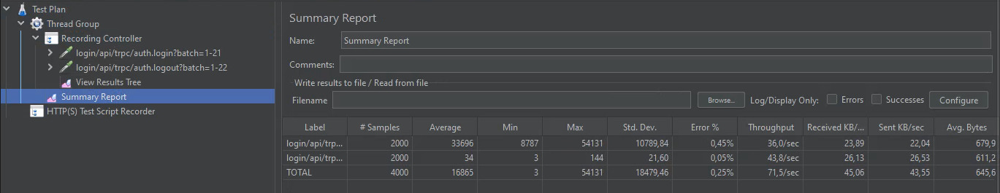

- Several tests were performed with different numbers of concurrent requests. Below is a comparison of the obtained data:

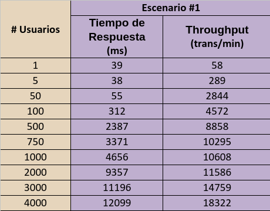

- Generated chart:

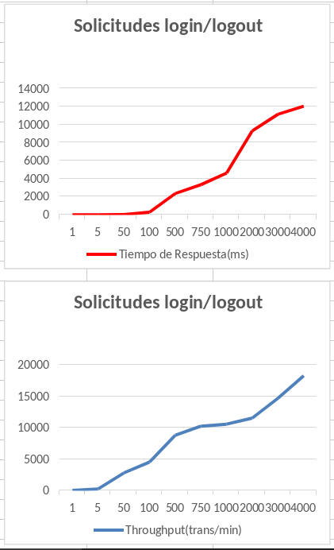

## Prototype

Please refer to the instructions given [here](https://github.com/SwArch-2025-1-2A/project?tab=readme-ov-file#meetun)
